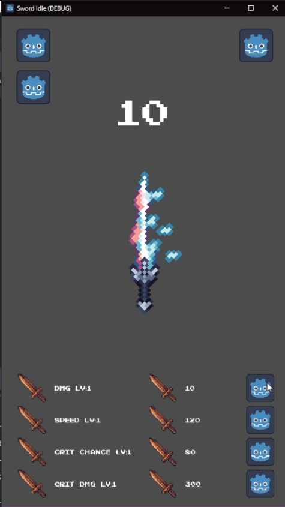

# Sword Idle Game Portfolio

## Introduction
    Welcome to **Sword Idle**, an engaging mobile clicker game where players swing swords to earn points and unlock upgrades. Experience the thrill of progression as each swing brings you closer to becoming a legendary swordsman in a vibrant and dynamic world!

## Game Overview
    Sword Idle allows players to immerse themselves in a thrilling idle experience, focusing on upgrading swords and maximizing scores.

## Key Features
- Click to swing the sword and earn coins.
- Upgrade swords to increase earnings.
- Intuitive and engaging gameplay.

## Technologies Used
- **Game Engine**: Godot
- **Programming Languages**: GD Script (Designed specifically for the Godot Engine. It features a syntax similar to **Python**. GD Script is optimized for game development, providing powerful tools for creating game logic, handling scenes, and managing user inputs efficiently. As an object-oriented programming (OOP) language, it supports the creation of classes and objects while adhering to key OOP principles such as inheritance, encapsulation, and polymorphism.
- **Data Formats**: XML(Used for Google AdMob API integration), JSON(Used for game save data management)
- **Tools**: Aseprite, Adobe Photoshop, Audacity.

## Development Process
- **Design**: I created initial game concepts and identified potential design hurdles that could impact player experience. Through extensive research and experimentation, I devised effective coding strategies to overcome these challenges, ensuring a smooth and engaging gameplay experience.

- **Prototype**: I developed a prototype to test core gameplay mechanics, allowing me to experiment with various features and gather initial feedback. This iterative process helped me refine my ideas and set a solid foundation for the full game.

- **Order Swords by Appeal**: I created a system to categorize and order the swords based on their visual appeal and gameplay attributes. This involved selecting unique designs and characteristics that resonate with players, enhancing the game’s overall aesthetics and engagement. 
- **Develop Functionality**: I implemented core game functionality, including the mechanics for swinging swords and earning scores. This required writing scripts in GD Script and thoroughly testing each feature to ensure they worked as intended.
- **Implement Save/Load System**: To enhance user experience, I developed a save/load system that allowed players to retain their progress. This feature was crucial for maintaining player engagement and ensuring they could return to the game without losing achievements.
- 
- **Design UX/UI**: I focused on creating an intuitive user experience (UX) and user interface (UI) that guides players seamlessly through the game. This involved designing menus, buttons, and in-game prompts that are visually appealing and easy to navigate. Also, I made a responsive UI that seamlessly adapts to various mobile device screens, ensuring a consistent and optimized user experience across all resolutions.

- **Implement Audio**: I integrated audio elements, including sound effects for sword swings and background music, to enhance the overall atmosphere of the game. This involved selecting appropriate audio clips and synchronizing them with gameplay actions for an immersive experience.

- **Integrate AdMob for Android Version**: I incorporated AdMob to monetize the Android version of the game. This process included setting up ad placements to ensure they did not disrupt gameplay, providing a balanced experience for players while generating revenue. Additionally, I implemented an incentive system where players could choose to watch video ads in exchange for a temporary x2 income boost. This feature not only enhances player engagement but also encourages them to interact with the ads in a way that benefits their gameplay experience.
- **Giving Credits & Writing Store Page Information**: I created a credits section to acknowledge contributors and resources used during development. Additionally, I wrote engaging descriptions and promotional content for the game's Google Play Store page to attract potential players.
- **Publishing on Google Play Store**: I published the Android version of the game on the Google Play Store, following all necessary guidelines to ensure a smooth launch process. The game is currently in a closed testing phase before becoming searchable on the Store.

- **Publishing on itch.io**: I also released the HTML5 version of the game on itch.io, making it accessible to a broader audience. This involved optimizing the game for web performance and ensuring a seamless user experience.

- **Implementing User Feedback**: I actively sought feedback from playtesters and gathered insights on gameplay mechanics and user interface elements. By analyzing this feedback, I made data-driven decisions to enhance the game's design. I iteratively refined the mechanics, adjusting the balance of difficulty, adding new features, and enhancing visual elements to create a more enjoyable and intuitive user experience.
- **Integrating Additional Features**: As development progressed, I identified opportunities to add new features that would enrich the game. I prioritized these enhancements based on player feedback and my vision for the game, ensuring that each addition aligned with the overall design goals.

## Live Demo
&nbsp;&nbsp;&nbsp;&nbsp;[Play Sword Idle on itch.io!](https://kokori-studio.itch.io/sword-idle)  
## Feedback and Iterations
- Player feedback led to enhancements in gameplay mechanics and user interface.
- Continuous updates based on user experience.

## Future Plans
- Explore adding new sword types and in-game events.
- Potential expansions based on user feedback.

## Contact
&nbsp;&nbsp;&nbsp;&nbsp;Feel free to reach out for inquiries: [kokori.studio@gmail.com]
